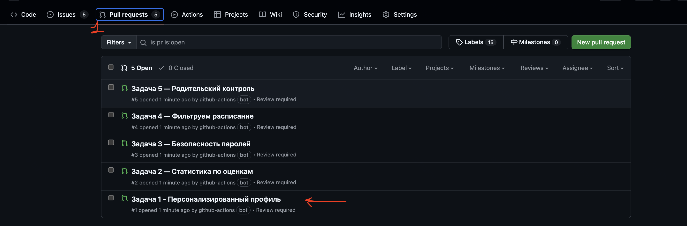
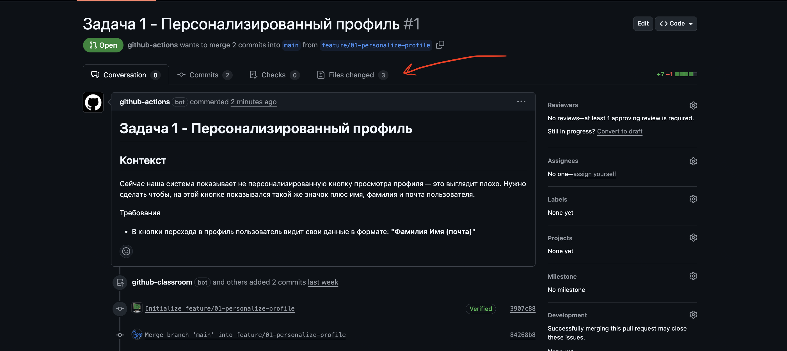
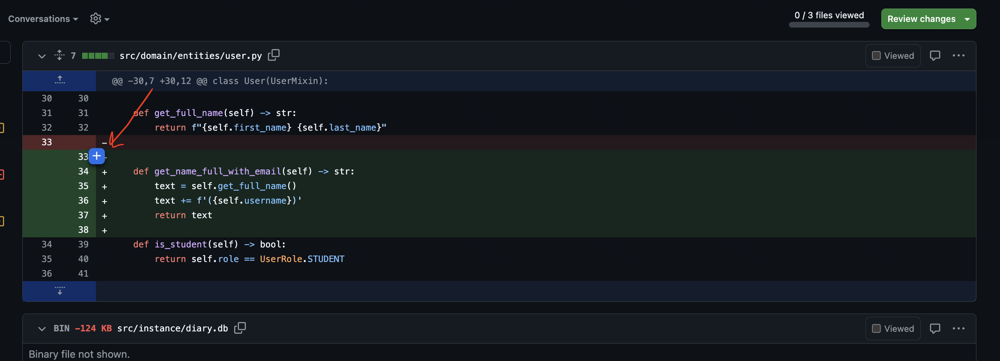
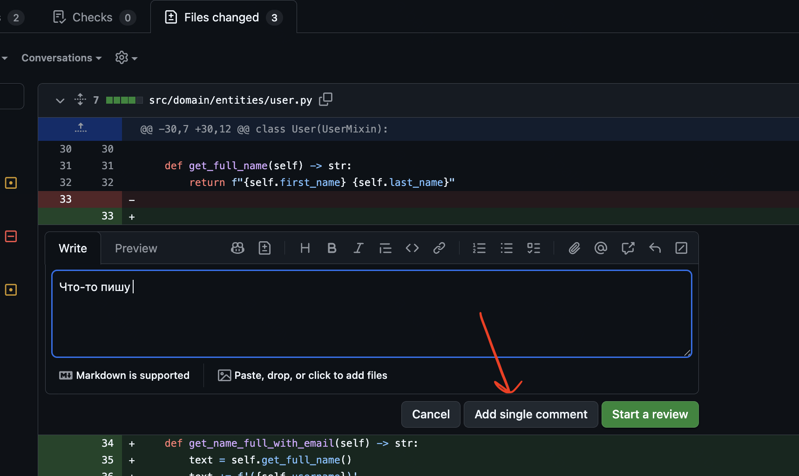
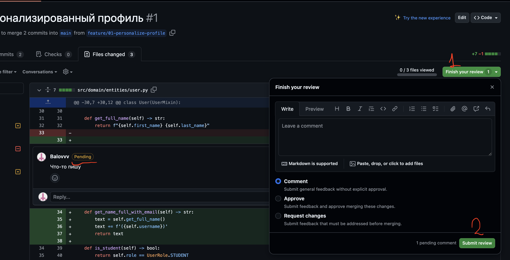

# Проведение ревью кода

В этом типе заданий тебе нужно проанализировать код, который написали другие разработчики.  
Мы заранее знаем, что в коде есть ошибки - твоя задача - найти их и корректно описать в комментариях.

Прежде чем начинать работу, важно понимать, что такое **Pull Request (PR)**.  
Pull Request - это запрос на внесение изменений в проект. Разработчик создаёт PR, когда завершил работу над задачей и хочет, чтобы его изменения проверили. Обычно PR содержит описание того, что было сделано, и список файлов, где есть изменения.  
Зачем это нужно? Чтобы поддерживать качество проекта. Перед тем как код попадёт в продакшен, другие разработчики проверяют его, находят ошибки, предлагают улучшения - именно этим ты и будешь заниматься.

## Шаг 1. Зайди в раздел **Pull requests**

Открой свой репозиторий на GitHub и перейди во вкладку **Pull requests**.  
Выбери любой pull request (PR) из списка.

## Шаг 2. Изучи описание задания и перейди к изменениям

1. В открытом PR прочитай:
   - название фичи;
   - описание (контекст - для чего она нужна);
   - требования к этой фиче.
2. После того как ты понял, что именно разработчик должен был сделать, перейди на вкладку **Files changed**, чтобы посмотреть изменения в коде.

## Шаг 3. Найди ошибки в коде

Внимательно просмотри изменённый код в **Files changed** и проверь, соответствует ли он требованиям из описания.

Если ты видишь потенциальную ошибку или проблему:
1. Наведи курсор на строку, где есть ошибка.
2. Нажми на кнопку **"+"**, чтобы добавить комментарий к этой строке.

## Шаг 4. Оставь понятный комментарий

В появившемся поле:
1. Подробно опиши, в чём заключается ошибка или проблема:
   - что именно не так;
   - к чему это может привести;
   - как примерно можно исправить (если понимаешь).
2. После этого нажми **"Add single comment"**, чтобы отправить комментарий.

## Шаг 5. Если ты случайно начал review

Иногда вместо **"Add single comment"** можно нажать **"Start review"**.  
В этом случае твои комментарии помечаются как **pending** (черновики) и не видны проверяющим, пока ты не отправишь review.

Понять это можно по подписи **"pending"** рядом с комментариями.

Чтобы отправить review:
1. Нажми кнопку **"Finish your review"**, выбери тип (например, **Comment**).
2. Нажми **"Submit review"**.

**Важно:**  
Если не отправить review, мы не увидим твои комментарии.

## Шаг 6. Разбери все pull requests

Найди ошибки **в каждом PR** (их всего 5).  
Ты можешь просматривать и разбирать pull requests в любом порядке.