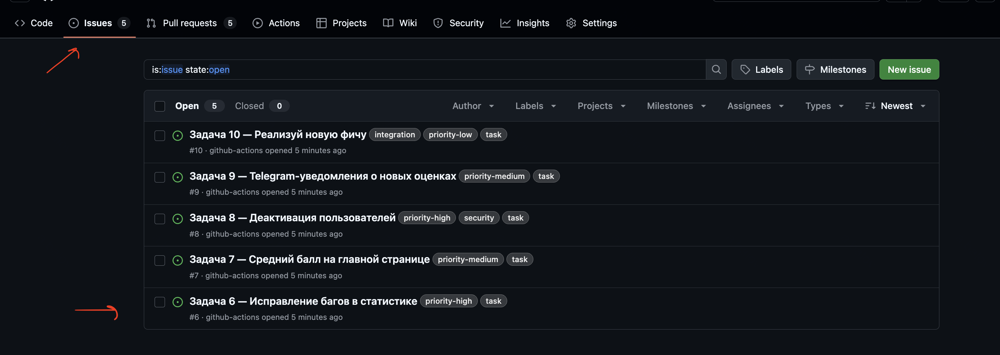
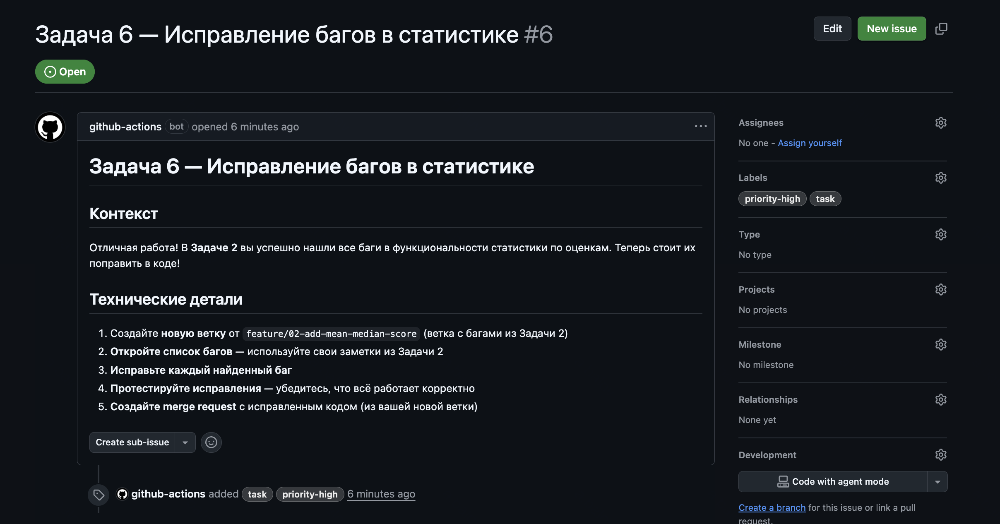
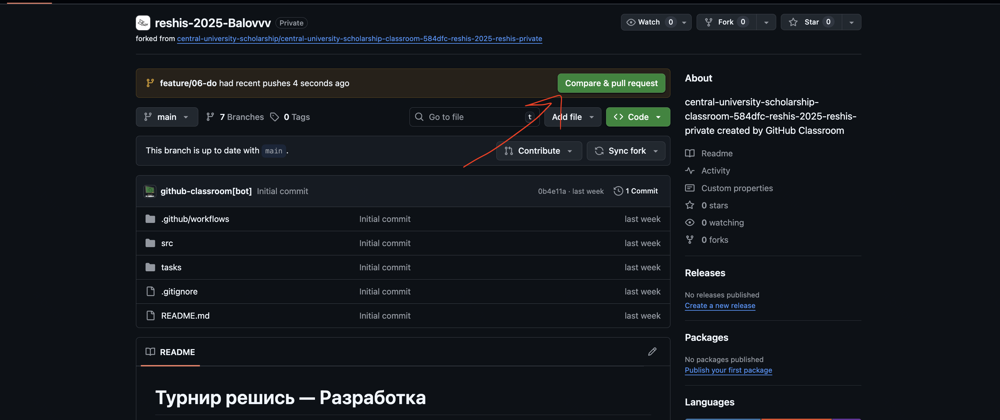
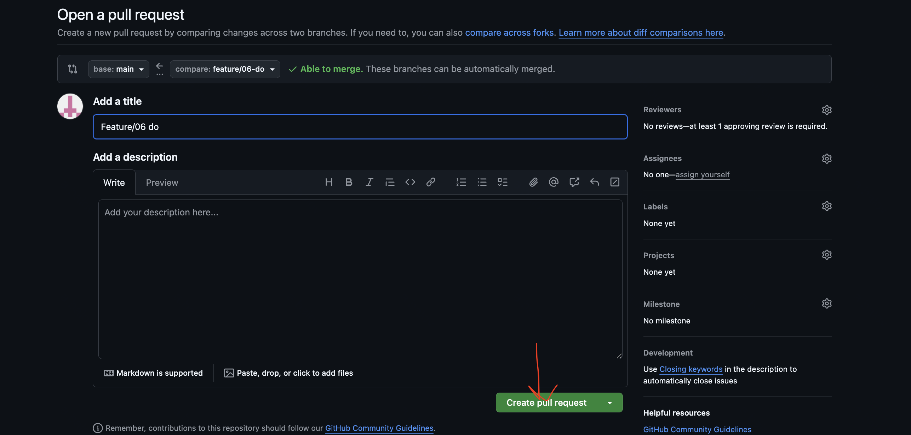

# Реализация задач

В этом типе заданий тебе нужно будет самостоятельно реализовывать фичи, описанные в **Issues**.  
Каждое issue — это задача, которую нужно выполнить: понять требования, написать код, создать PR и отправить его на проверку.

## Шаг 1. Зайди в раздел **Issues**

Открой свой репозиторий и перейди во вкладку **Issues**.  
Выбери любую задачу из списка.



## Шаг 2. Изучи задачу

Внутри issue ты найдёшь:

- название фичи;
- описание и контекст (зачем она нужна);
- технические требования;
- возможные подсказки.

Внимательно прочитай текст задачи, чтобы понимать, что именно нужно реализовать.



## Шаг 3. Приступай к реализации фичи

Перед началом важно понять, что такое **ветки (branches)**.  
Ветка — это отдельная версия кода. Она позволяет тебе вносить изменения, не ломая основную рабочую версию проекта (**main**).  

Зачем это нужно?
- Ты можешь спокойно экспериментировать и писать код.
- Остальные участники команды видят, над чем ты работаешь.
- Когда работа закончена — изменения проходят ревью и аккуратно вливаются в проект через Pull Request.

---

### Шаг 3.1. Создай новую ветку от `main`

Если в задаче не указана другая ветка — работай всегда от **main**.

```bash
git switch -c feature/{НОМЕР_ISSUE}-{любой-текст}
````

Пример:

```bash
git switch -c feature/12-add-user-validation
```

### Шаг 3.2. Напиши код

Реализуй функциональность согласно описанию issue.

### Шаг 3.3. Добавь изменения и сделай коммит

```bash
git add .
git commit -m "Короткое и понятное описание, например: реализовал проверку имени пользователя"
```

## Шаг 4. Отправь изменения на GitHub

```bash
git push
```

Если это **первый пуш новой ветки**, Git может показать сообщение вида:

```
hint: ... use
hint:
hint:   git push --set-upstream origin имя-ветки
```

👉 Просто **скопируй предложенную команду** и вставь её в терминал.

## Шаг 5. Создай Pull Request

После отправки ветки зайди на GitHub — там появится предложение создать PR.




Нажми кнопку **Create pull request** и отправь его.

## Шаг 6. Вносишь изменения? Просто пушь снова

Если хочешь что-то исправить или добавить:

```bash
git add .
git commit -m "добавил исправления"
git push
```

Все новые коммиты автоматически появятся в твоём PR.

## Шаг 7. Завершил работу? Переключись обратно на `main`

Когда PR создан и ты закончил работу над задачей:

```bash
git switch main
```