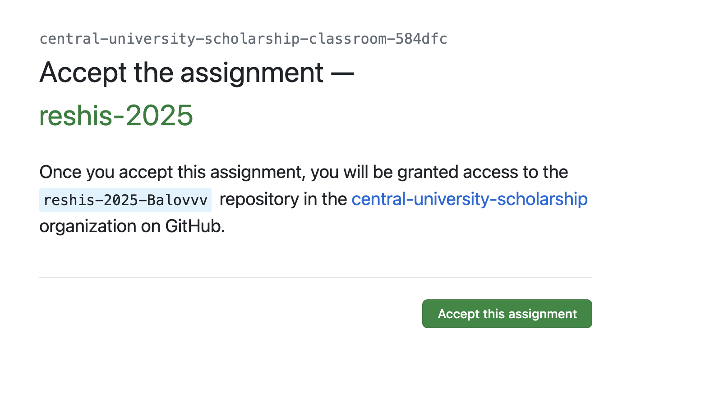
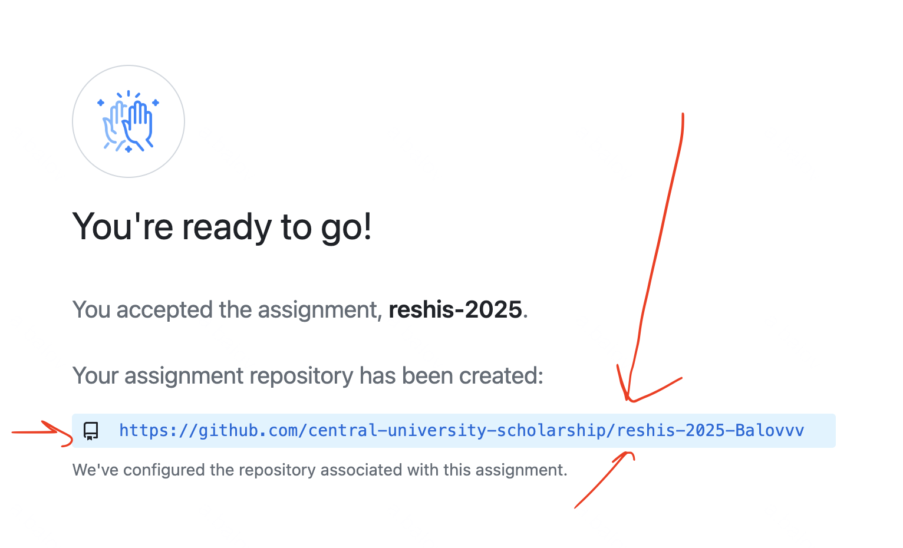
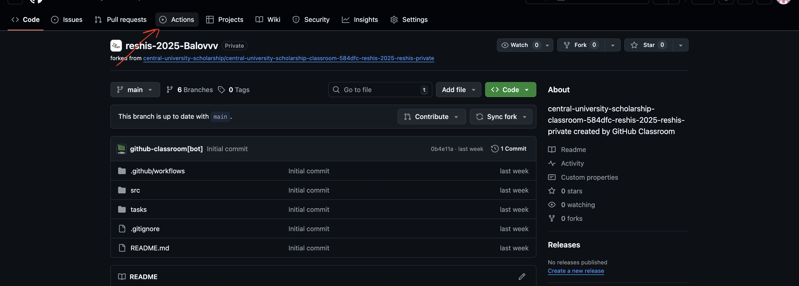
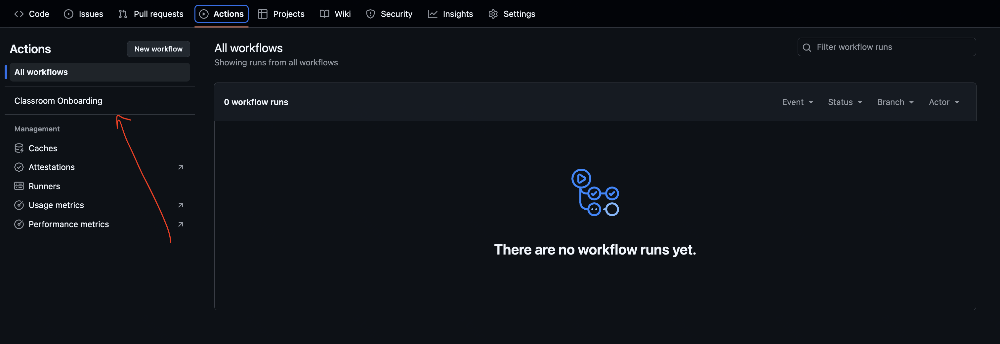
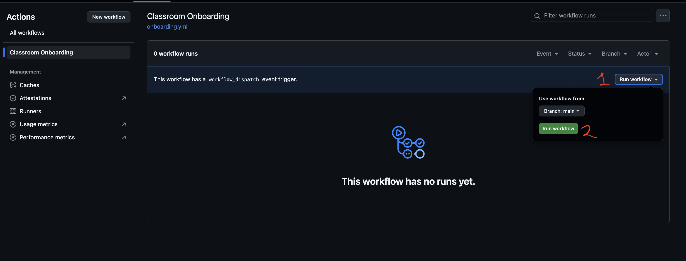
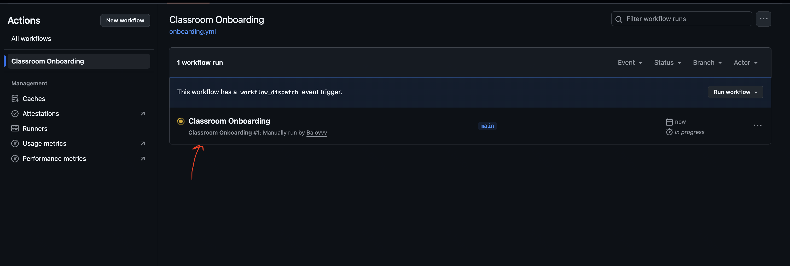
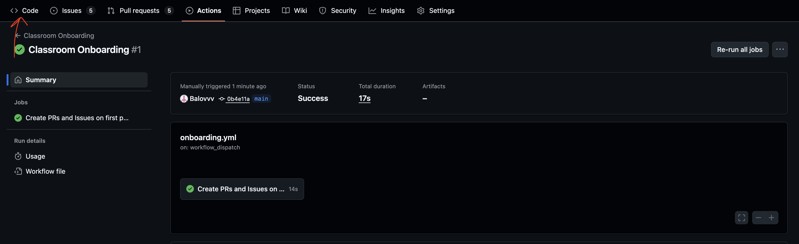

# Начало работы над проектом

Ниже - пошаговая инструкция, которая поможет тебе зарегистрироваться в GitHub, получить свой репозиторий через GitHub Classroom и корректно запустить начальный workflow.
Пожалуйста, выполни все шаги внимательно - это важно для правильной работы проекта.

## 1. Регистрация в GitHub

Если у тебя уже есть аккаунт GitHub - просто войди в него.

Если аккаунта нет, сделай следующее:

1. Перейди по ссылке: https://github.com/signup
2. Заполни форму и создай аккаунт.
3. Подтверди регистрацию по электронной почте, если GitHub это попросит.

После регистрации убедись, что ты вошёл в свой аккаунт.

## 2. Получение репозитория через GitHub Classroom

### Шаг 1. Перейди по ссылке задания

Открой ссылку на задание:
https://classroom.github.com/a/TXLoIMP1

### Шаг 2. Нажми кнопку **"Accept this assignment"**

На странице задания нажми зелёную кнопку **"Accept this assignment"**.

Подожди несколько секунд — GitHub Classroom создаст для тебя личный репозиторий.

### Шаг 3. Открой свой репозиторий

Когда репозиторий будет создан, нажми на ссылку, ведущую в твой личный репозиторий.

**Важно:** всю дальнейшую работу нужно делать **только в этом репозитории**.
Создавать дополнительные репозитории не нужно.

> Если ты потеряешь ссылку на свой репозиторий, ее всегда можно найти на странице задания:
https://classroom.github.com/a/TXLoIMP1

# Перед началом работы

Перед тем как начинать работу, нужно один раз запустить специальный workflow, который подготовит проект.

## Шаг 1. Зайди во вкладку **Actions**

Открой свой репозиторий и перейди в раздел **Actions** в верхнем меню.

## Шаг 2. Выбери workflow **"Classroom Onboarding"**

Найди в списке workflows пункт **"Classroom Onboarding"** и открой его.

## Шаг 3. Запусти workflow

Нажми кнопку **"Run workflow"** и подтверди запуск.

## Шаг 4. Обнови страницу и зайди в workflow

После запуска обнови страницу (F5 или Ctrl+R) и снова открой этот workflow, чтобы увидеть его статус.

## Шаг 5. Дождись завершения

Подожди, пока workflow полностью выполнится.
Когда появится зелёная галочка - всё готово.

Теперь можешь вернуться во вкладку **Code**.

---

Теперь твой репозиторий полностью готов к работе — можешь приступать к выполнению заданий.